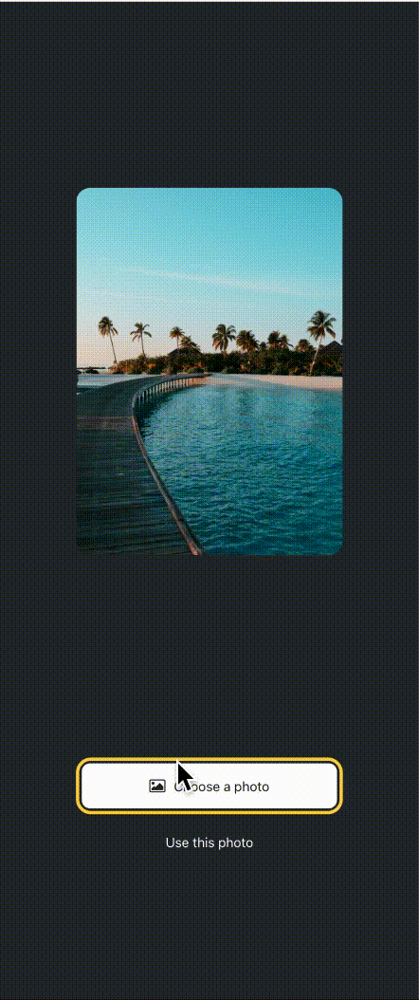

<a name="readme-top"></a>

<!-- TABLE OF CONTENTS -->
# 📗 Table of Contents

- [📖 About the Project](#about-project)
    - [Tech Stack](#tech-stack)
    - [Key Features](#key-features)
- [🚀 Live demo](#live-demo)
- [💻 Getting Started](#getting-started)
  - [Setup](#setup)
  - [Prerequisites](#prerequisites)
  - [Install](#install)
  - [Usage](#usage)
  - [Run tests](#run-tests)
- [👥 Authors](#authors)
- [🔭 Future Features](#future-features)
- [🤝 Contributing](#contributing)
- [⭐️ Show your support](#support)
- [🙏 Acknowledgements](#acknowledgements)
- [📝 License](#license)

<!-- PROJECT DESCRIPTION -->

# 📖 Sticker Smash <a name="about-project"></a>

**Sticker Smash** Is an Expo React Native project for users to add a photo or screen shot, add an emoji, add animation to emoji using iPhone or Android features.

## 🛠 Built With <a name="built-with"></a>


  <ul>
    <li><a href="https://www.expo.dev/">Expo</a></li>
    <li><a href="https://www.reactnative.dev/">React Native</a></li>
    <li><a href="https://www.expo.dev/">React</a></li>
  </ul>


<!-- Features -->

### Key Features <a name="key-features"></a>

- **Users can add an emoji to default image**
- **Users can select image of phone to replace default image**
- **Users can select from a list of emojis to add on top of image**
- **Users can can save edited photo to their phone**

<p align="right">(<a href="#readme-top">back to top</a>)</p>

## 💻 Live Demo <a name="live-demo"></a>



<!-- GETTING STARTED -->

## 💻 Getting Started <a name="getting-started"></a>

To get the content of this project locally you need to run the following commands in your terminal:

and follow these steps.

### Prerequisites

- IDE(code editor) like: **Vscode**, **Sublime**, etc.
- [Git](https://www.linode.com/docs/guides/how-to-install-git-on-linux-mac-and-windows/)

### Setup

Clone this repository to your desired folder:

1. Download the **Zip** file or clone the repo with:
 ```bash
git clone git@github.com:gjuliao/StickerSmash.git
```
2. To access cloned directory run:
```bash
cd StickersSmash
```

### Install

Install dependancies with:

```bash
npm install
```

### Usage

To run the project, execute the following command:

```bash
npx expo start
```


### Deployment

You can deploy this project using:

- [Render](https://render.com/)

<p align="right">(<a href="#readme-top">back to top</a>)</p>

<!-- AUTHORS -->

## 👥 Authors <a name="authors"></a>

👤 **Giovanni Juliao**

- GitHub: [@gjuliao](https://github.com/gjuliao)
- LinkedIn: [giovanni-juliao](https://www.linkedin.com/in/giovanni-juliao/)

<p align="right">(<a href="#readme-top">back to top</a>)</p>

<!-- FUTURE FEATURES -->

## 🔭 Future Features <a name="future-features"></a>

- **Add editing features**
- **Sharing features**

<p align="right">(<a href="#readme-top">back to top</a>)</p>

<!-- CONTRIBUTING -->

## 🤝 Contributing <a name="contributing"></a>

Contributions, issues, and feature requests are welcome!


Feel free to check the [issues page](https://github.com/gjuliao/StickerSmash/issues).


<p align="right">(<a href="#readme-top">back to top</a>)</p>

<!-- SUPPORT -->

## ⭐️ Show your support <a name="support"></a>

If you like this project please give it a star.

<p align="right">(<a href="#readme-top">back to top</a>)</p>

<!-- ACKNOWLEDGEMENTS -->

<p align="right">(<a href="#readme-top">back to top</a>)</p>

<!-- LICENSE -->

## 📝 License <a name="license"></a>

This project is [MIT](./LICENSE) licensed.

<p align="right">(<a href="#readme-top">back to top</a>)</p>